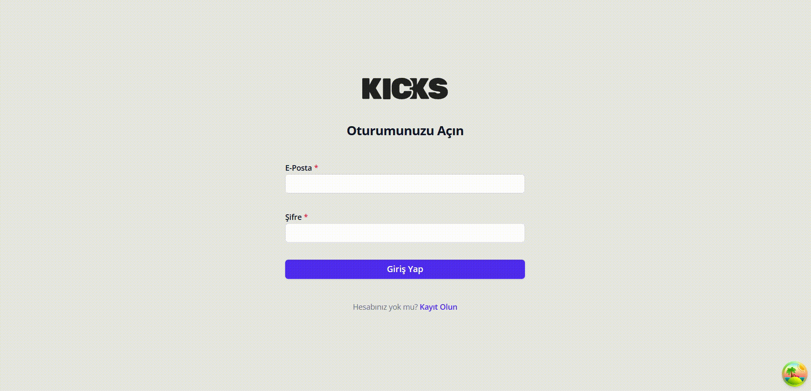

# 👟 KICKS_SHOE - Ayakkabı Yönetim Paneli

KICKS_SHOE, bir ayakkabı mağazası için geliştirilmiş basit ve kullanıcı dostu bir **yönetim paneli** uygulamasıdır. Bu panel sayesinde mağaza yöneticileri ürünleri kolayca ekleyebilir, düzenleyebilir ve listeleyebilir.

Bu proje, yazılım geliştirmeye yeni başlayanlar veya hiç teknik bilgisi olmayanlar için bile anlaşılır olacak şekilde tasarlanmıştır.

---

📸 Ekran Görüntüsü

---

## 📸 Uygulama Ne Yapar?

- 👤 **Giriş ve Kayıt Sayfaları**: Kullanıcılar sisteme giriş yapabilir veya yeni hesap oluşturabilir.
- 📝 **Ürün Ekleme Formu**: Yeni ayakkabı ürünleri eklemek için basit bir form.
- ✏️ **Ürün Düzenleme Sayfası**: Var olan ürünleri güncelleme imkanı.
- 📋 **Ürün Listesi**: Tüm ürünleri listeleyen bir sayfa.
- ✅ **Onay Kutuları ve Seçim Butonları**: Ürün özelliklerini seçmek için kolay arayüz.

---

## 🧠 Kullanılan Teknolojiler (Kısaca)

| Teknoloji        | Açıklama                                         |
| ---------------- | ------------------------------------------------ |
| **React**        | Web arayüzünü oluşturmak için kullanılır.        |
| **TypeScript**   | Kodun daha güvenli ve anlaşılır olmasını sağlar. |
| **Formik**       | Formları kolayca yönetmemizi sağlar.             |
| **Yup**          | Form doğrulama kurallarını tanımlar.             |
| **Tailwind CSS** | Sayfanın görünümünü düzenlemek için kullanılır.  |
| **Vite**         | Projeyi hızlı çalıştırmak için kullanılan araç.  |

---
